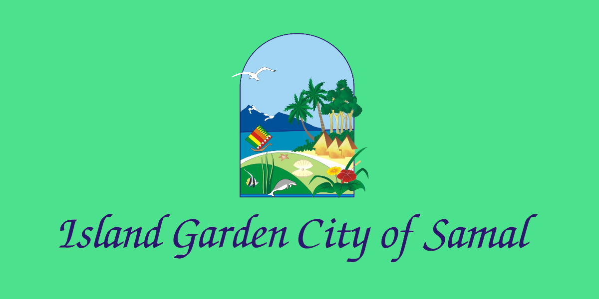
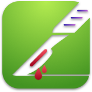

# Hotel Reservation System
A system which aims to assist people to reserve rooms at Samal Hotels

## Table of contents
* [General info](#hotel-reservation-system)
* [Organization](#organization)
* [Technologies](#technologies)

## Organization
Samal Davao

## Technologies
These will be the technologies for the stack 
* Laravel 
* Breeze 
* Blade 

## Purpose/Details of the system

The aim of this system is to help tourists or anyone who would like to book a hotel at Samal. This system would make booking easier since we can register hotels in the system. A collective place where the hotels of samal would now exist and it make it even easier for people to book. The stack will consist of Laravel, Breeze, and Blade.

